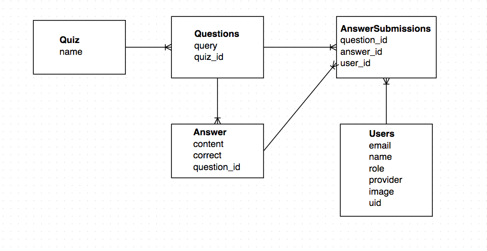

# Multiple-Choice App

An application that allows instructors to easily create and administer multiple-choice quizzes.

Inspired by a chapter in [_Make it Stick: The Science of Successful Learning_](http://www.hup.harvard.edu/catalog.php?isbn=9780674729018) in which students test scores rose an entire letter grade, simply by implementing short, post-lecture quizzes.

## Features
* GitHub Authentication
* Loading of YAML-formatted Question Sets from lib/assets/questions via `rake db:seed`

## ER Diagram

## User Stories
### Instructor Inputs a Question

As an instructor
I want to add a new question
So that I can test student's knowledge.

#### Acceptance Criteria:
* [] I can navigate to a page to input a new question.
* [] I must input a question, a correct answer, as well as one
or more incorrect answers.
* [] If I forget one of these fields, I am presented with errors.

### Instructor Sees Percentage of Correct Responses

As an instructor
I want to see the percentage of students that answered a question correctly
So that I can know how well the lecture was received.

#### Acceptance Criteria:
* [] I can navigate to a show page for questions.
* [] I see a list of questions with a score for each.
* [] I see the number of students that have submitted an answer for
a particular question.

### Student Answers a Question

As a student
I want to answer a question related to lecture
So that I can test my knowledge of what I just learned.

#### Acceptance Criteria:
* [] I am displayed a multiple choice question
* [] I am notified if my response is correct or incorrect

### Student Answers a Series of Questions

As a student
I want to be presented with a sequence of questions related to a lecture
So that I can test my knowledge of what I just learned.

#### Acceptance Criteria:
* [] I am presented a series of multiple choice questions.
* [] When I complete the last question in the series, I see an end screen.

### Student Submits Anonymous "I'm Lost"

As a student
I want to anonymously indicate that I'm lost during facilitation
So that I can indicate comprehension to the staff.

#### Acceptance Criteria:
* [] I can navigate to a central page and signal that I'm lost
* [] I am notified if my signal was successful
* [] My I'm lost signal fades away after a short period of time.

### Instructor Sees Number of "I'm Lost"s

As an instructor
I want to see how many I'm lost signals have been received while I facilitate
So that I am aware of how effective my facilitation is.

#### Acceptance Criteria:
* [] I can navigate to a page for I'm lost signals
* [] I can leave this page open and see live I'm lost signals come and go
* [] I can see a raw number of total I'm losts.
* [] When the signals grow beyond a certain level, I am alerted.
* [] I can clear out all I'm lost signals.
